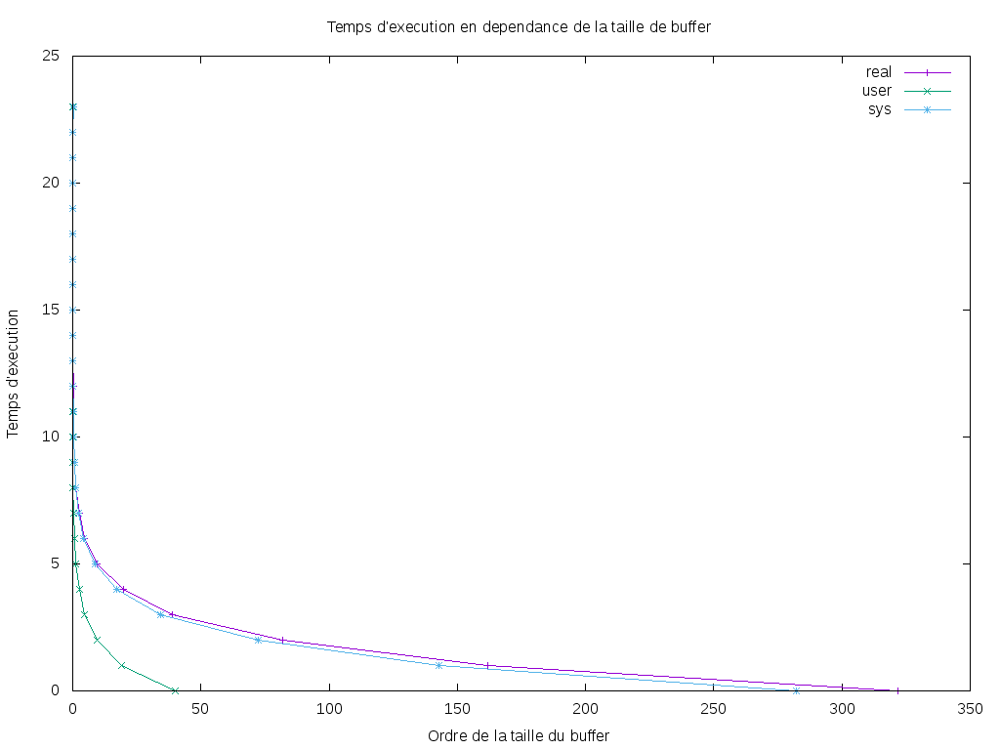

#   Performances des entrées/sorties

#### AUTEURS: Riad SABIR

> #### Important:
> Toute manipulation(commande) décrite dans ce fichier est effectuée depuis le dossier racine du projet (pds-fs/du).


Ce répertoire correspond aux exercices de la section
[Performances des entrées/sorties](http://www.fil.univ-lille1.fr/~hym/e/pds/tp/tdfs-perfio.html).

Présentation du TP et de ses objectifs
---------------------------------------

- Montrer que la mise en mémoire tampon améliore grandement les performances des opérations d'entrées/sorties
- Programmation de l'outil `mcat-scd` (system call dynamic)
- Produire un graphe via l'outil gnuplot qui représente les différentes performances en temps réel/utilisateur/système ; Et ce en fonction de la taille du buffer (tampon)

Arborescence du projet
----------------------

```
$ tree
.
├── Makefile
├── mcat-scd.c
├── mcat_tm.png
├── plot.plt
├── README.md
└── test.sh
```

Comment récupérer le projet
-----------------------------

```
$ git clone git@gitlab-etu.fil.univ-lille1.fr:sasu/pds-fs.git
```
Compilation et exécution des programmes
--------------------------------------------

```  
$ make mcat-scd
```

Compilation et exécution des tests
--------------------------------------------

```  
$ make test
```
> #### Note:
> Cela lance le script bash qui va créer des fichiers et ensuite tester  l'outil. Les fichiers créés sont effacés avec la commande `make clean`.

Comment créer le graphique
------------------------------
Après l'exécution du test, on utilise `gnuplot` qui va lire les données
dans le fichier `mcat_tm.dat`, générées après l'exécution de `test.sh`.
Le graphique sera sauvgardé dans le fichier `mcat_tm.png`.

```
$ gnuplot mcat.gp
```

Comment "nettoyer" le projet
------------------------------

```
$ make clean
```

> #### Note:
> Cela supprimera les fichiers test ainsi que l'exécutable `mcat-scd`.


Voici le modèle d'exécution de `mcat-scd` :
-----------------------------------------
```
$ ./mcat-scd [FICHIER]
```

Temps d'exécution vs taille de buffer
-------------------------------------

